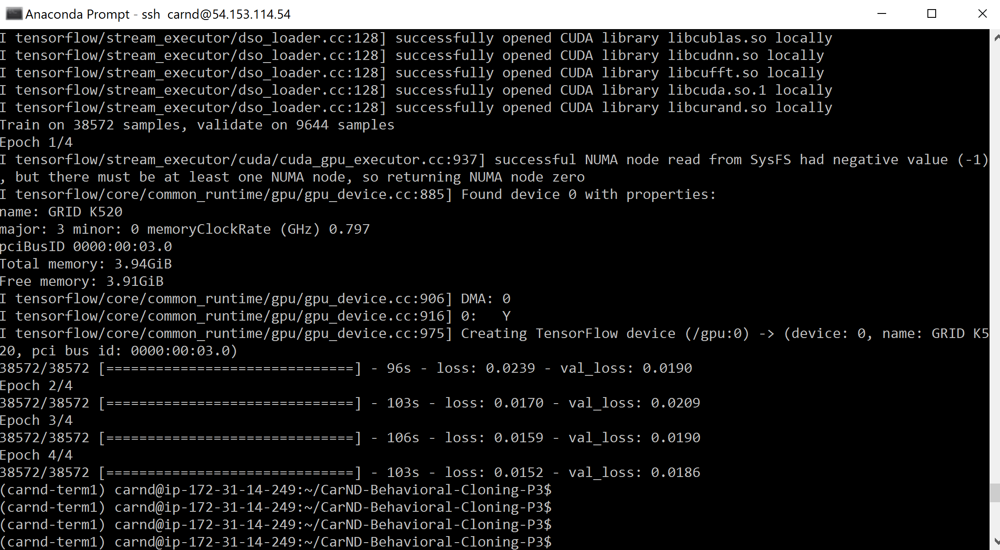

# **Behavioral Cloning** 

## Writeup 

### This is a write up for the third project that involves behavioral cloning using CNNs.

---

**Behavioral Cloning Project**

The goals / steps of this project are the following:
* Use the simulator to collect data of good driving behavior
* Build, a convolution neural network in Keras that predicts steering angles from images
* Train and validate the model with a training and validation set
* Test that the model successfully drives around track one without leaving the road
* Summarize the results with a written report


[//]: # (Image References)

[image1]: ./examples/nVidia_model.png "Model Visualization"
[image2]: ./examples/conv_arch.png "Convolution Architecture"
[image3]: ./examples/center_2016_12_01_13_30_48_287.jpg "Simulator"
[image4]: ./examples/model.PNG "Convolutional Neural Network in Keras"
[image5]: ./examples/model_results.PNG "Model Results"
[image6]: ./examples/car_driving.PNG "Autonomous Mode"

## Rubric Points
### Here I will consider the [rubric points](https://review.udacity.com/#!/rubrics/432/view) individually and describe how I addressed each point in my implementation.  

---
### Files Submitted & Code Quality

#### 1. Submission includes all required files and can be used to run the simulator in autonomous mode

My project includes the following files:
* model.py containing the script to create and train the model
* drive.py for driving the car in autonomous mode
* model.h5 containing a trained convolution neural network 
* writeup_report.md or writeup_report.pdf summarizing the results

#### 2. Submission includes functional code
Using the Udacity provided simulator and my drive.py file, the car can be driven autonomously around the track by executing 
```sh
python drive.py model.h5
```

#### 3. Submission code is usable and readable

The model.py file contains the code for training and saving the convolution neural network. The file shows the pipeline I used for training and validating the model, and it contains comments to explain how the code works.

### Model Architecture and Training Strategy

#### 1. An appropriate model architecture has been employed

The training of the model is based on 8036 snaps of 3 camera angles: center, left and right. The total image dataset includes all the 3 angles with total dataset of 24,108 images. I worked with data set provided by Udacity as my dataset of 1 lap of training was not adequate. he images are in three colums, snapped from center, right and left cameras. They have a corresponding steering angle -- the steer the car had to make in that frame to stay on the track. We load both into ```images[]``` and ```measurements``` arrays as introduced in ```clone.py```.

The modified general structure of the model is based on an end-to-end convolution neural network architecture  described by Nvidia [here](http://bit.ly/1T206A2). 

<p align="center">
 
</p>

The network consists of 12 layers, including a normalization layer, 5 convolutional layers and 3 fully connected layers.  Here is the structure of the model I used:-

<p align="center">
 
</p>

Firstly, we use Keras' lambda feature to normalize the images. Then we crop out the front of the car in the bottom of the image and the sky from the top, using the Cropping2D method. 

The model's first 3 convolutional layers have a 2 X 2 stride, 5 X 5 kernel and a relu activation similar to what is shown in nVidia paper. The last 2 convolutional layers are non-strided, with a 3 X 3 kernel size. Following the convolutional layers, we have a flatten layer, followed by the 3 fully-connected layers featuring 100, 50 and finally 1 neuron.

Results after 4 epochs

<p align="center">
 
</p>


#### 2. Attempts to reduce overfitting in the model

The model was trained and validated on different data sets to ensure that the model was not overfitting (code line 51-61). The model was tested by running it through the simulator and ensuring that the vehicle could stay on the track.

#### 3. Model parameter tuning

The model used an adam optimizer, so the learning rate was not tuned manually (model.py line 89).

#### 4. Appropriate training data

Training data was chosen to keep the vehicle driving on the road. I used a combination of center lane driving, recovering from the left and right sides of the road.

I used Udacity's dataset to create additional dataset.

For details about how I created the training data, see the next section. 

### Model Architecture and Training Strategy

#### 1. Solution Design Approach

The overall strategy for deriving a model architecture was to ...

My first step was to use a linear regression model similar to the to the one in ```clone.py```.  I started with this to ensure I am able to run following key steps successfully:-

1. Train the model on AWS instance
2. Run in the simulator successfully

Once I had confidence on this process, I started tweaking the model by first increasing the dataset using all the three camera images and then augmenting the dataset using additional horizontally flipped images  from the three (center, left and right) images.

<p align="center">
 
</p>

Similarly I added random brightness and then cropped the dataset to make my training go faster. Here's the code:

Dataset Augmentation 
```
# Arrays to store additional images and measurements
add_images = []
add_measurements = []
for image, measurement in zip(images, measurements):
	add_images.append(image)
	add_measurements.append(measurement)
	# Flip images to reduce bias from anti-clockwise driving
	flipped_image = cv2.flip(image, 1)
	flipped_measurement = float(measurement) * -1.0
	add_images.append(flipped_image)
	add_measurements.append(flipped_measurement)

X_train = np.array(add_images[])
y_train = np.array(add_measurements[])
```
Cropping the images

```
model = Sequential()
model.add(Lambda(lambda x: x / 255.0 - 0.5, input_shape=(160,320,3)))
model.add(Cropping2D(cropping=((70,25),(1,1))))
```

In order to gauge how well the model was working, I split my image and steering angle data into a training and validation set. I started by looking at small number of epocs (4). I found that the car was able to drive half way through the tracks and then it got stuck since it was over steering in left direction. 

<p align="center">
 
</p>

To combat this , I modified the model by including the left and right side images and adding a 0.2 steering angle correction for left images, and subtract the same amount for right images. 

With additional tweaks of the nVidia model and guidance from the Udacity video [here](http://bit.ly/2kwk5kz).

At the end of the process, the vehicle is able to drive autonomously around the track without leaving the road.

#### 2. Final Model Architecture

The final model architecture is shown below:-
```
model = Sequential()
model.add(Lambda(lambda x: x / 255.0 - 0.5, input_shape=(160,320,3)))
model.add(Cropping2D(cropping=((70,25),(1,1))))
model.add(Convolution2D(24,5,5, subsample=(2,2),activation='relu'))
model.add(Convolution2D(36,5,5,subsample=(2,2),activation='relu'))
model.add(Convolution2D(48,5,5,subsample=(2,2),activation='relu'))
model.add(Convolution2D(64,3,3,activation='relu'))
model.add(Convolution2D(64,3,3,activation='relu'))
model.add(Flatten())
model.add(Dense(100))
model.add(Dense(50))
model.add(Dense(10))
model.add(Dense(1))
```
This is also described in section 1. 

The network consists of normalization layer followed by 5 convolution layers followed by 4 fully connected layers. 


#### 3. Creation of the Training Set & Training Process

Although I was able to run the car in a training mode, I was not able to drive the car in a controlled fashion 

After the collection process, I had data points which was far less than the Udacity dataset. So I ended up using the bigger datatset to save time.

However, if I were to generate the dataset, I would be following the steps listed below:-

1. Move the car off the center lane to ensure we capture the recovery behavior of the car. Thus is the car is approaching left lane marker, then it will be moved to center and similarly for the right lane makers. The idea is to teach car what to do when it's off on the side of the road. Constant wandering to the side of the road and steering back towards the center line could help train the model for such deviations.

2. The first training track is biased towards left turns, so one way to get around this would be to collect data going around the track both in forward and backward directions. So driving counter-clockwise is additional way to generate the data.

3. Collecting enough data is critical as well.

I finally randomly shuffled the data set and put 20% of the data into a validation set. 

I used this training data for training the model. The validation set helped determine if the model was over or under fitting. The ideal number of epochs was 8 as evidenced by validation error starting to oscillate instead of continue to go down.  I used an adam optimizer so that manually training the learning rate wasn't necessary.
